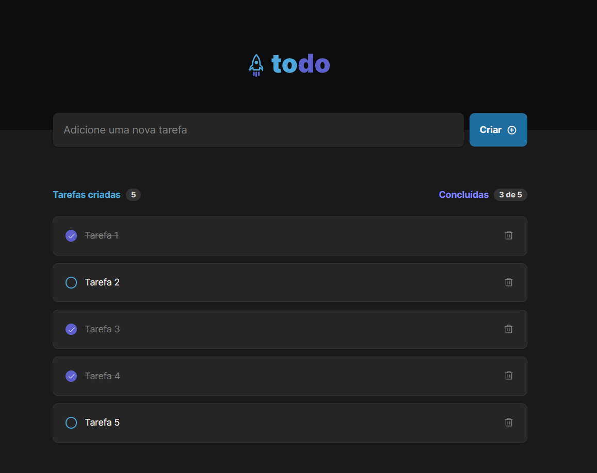

# Todo

Aplicação React de controle de tarefas no estilo **to-do list**, que contém as seguintes funcionalidades:

- Adicionar uma nova tarefa
- Marcar e desmarcar uma tarefa como concluída
- Remover uma tarefa da listagem
- Mostrar o progresso de conclusão das tarefas

Foi criada com Vite (https://vitejs.dev/) usando o template de TypeScript.

Esta aplicação utiliza os seguintes conhecimentos de React:

- Estados
- Imutabilidade do estado
- Listas e chaves no ReactJS
- Propriedades
- Componentização

## Bibliotecas utilizadas

- [@phosphor-icons/react] (https://github.com/phosphor-icons/react)
- [@rocketseat/eslint-config] (https://github.com/Rocketseat/eslint-config-rocketseat)

## Para executar a aplicação

Baixar dependências:

```shell
npm i
```

Executar o comando:

```shell
npm run dev
```

## Telas

### Tela sem tarefas adicionais


### Tela com tarefas adicionas (com algumas concluídas)


